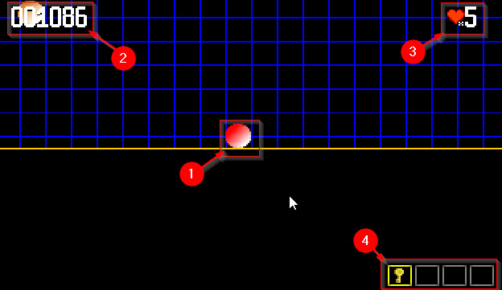

# fromClassToGame

[](https://github.com/mcgivrer/fromClassToGame/actions/workflows/maven.yml)
[](https://www.codacy.com/gh/mcgivrer/fromClassToGame/dashboard?utm_source=github.com&utm_medium=referral&utm_content=mcgivrer/fromClassToGame&utm_campaign=Badge_Grade)
[](https://app.fossa.com/projects/git%2Bgithub.com%2Fmcgivrer%2FfromClassToGame?ref=badge_shield)
[](https://snyk.io//test/github/mcgivrer/fromClassToGame?targetFile=pom.xml)
[](https://www.codacy.com/gh/mcgivrer/fromClassToGame/dashboard?utm_source=github.com&utm_medium=referral&utm_content=mcgivrer/fromClassToGame&utm_campaign=Badge_Coverage)
[](https://reports.cucumber.io/report-collections/dce051b0-e607-40d6-af37-8bf5b67deb97 "See the latest Cucumber Reports")

## Description

This project is a journey from a Class to a Game. First commits will set the basis, and progressively transform, chapter
after chapter, the initial class into a playable game.

During the chapters from the `docs/` you will transform the
simple [`Game`](https://github.com/mcgivrer/fromClassToGame/blob/7c621c4aaa11f327e8f7b83eedfbcff306bc606a/src/main/java/fr/snapgames/fromclasstogame/Game.java "Go and see where all begin with the Game class")
class from beginning to a package
structured [framework](https://github.com/mcgivrer/fromClassToGame/tree/main/src/main/java/fr/snapgames/fromclasstogame/core "See the current core package structure")
with some useful features to support object management and display, and just now how to organize the code in a project,
using a bit of TDD to develop and refactor

## Latest evolution

Added some valuable features like:

- A Core `Game` class,
- A standard central `GameObject`,
- an `InputHandler` to capture player interaction
- A `ResourceManager` service,
- A `SceneManager` service,
- A `SystemManager` and convert any service to `System` interface,
- Implement a `Render` upon Graphics2D and `RenderHelper`,
- Some fancy other objects like `TextObject`, `LifeObject` or `ScoreObject`,
- A `Camera` to move view with following a specific target,
- A `PhysicEngine` to compute more realistic moves,
- Some `Behavior` capability to GameObject,
- A Map of `attributes` to GameObject
- A new `InventoryObject` to manage a player inventory with its own render helper and behavior,

## More to come

- A `CollisionSystem` is a work in progress
- Some `TileMap` object to display beautiful game level graphic set and all its dependencies (`Tile`, `TileSet`
  and `TileLayer`) are also work in progress !
- A Mouse and Gamepad events integration to rules'em all !

## Build, Run and See

### How to build

To build the project, the good maven command is :

```bash
mvn clean install
```

### Starting test

To execute test verification, using a bunch of [cucumber](https://cucumber.io/ "visit the official site") tests :

```bash
mvn test
```

### Running the beast

And finally, to run such a beautiful piece of code :

```bash
mvn exec:java
```

You will get the current display:



This sample demo will show :

1. Some `GameObject` as player (the red one), and some random spawning enemies (orange ones),
2. the `ScoreObject`, displaying score (sic),
3. the `LifeObject` showing the remaining number of life,
4. the `InventoryObject`, showing a qick inventory to select an available item.