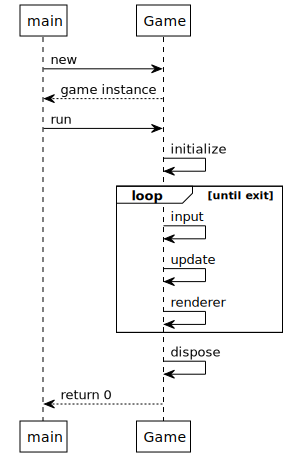
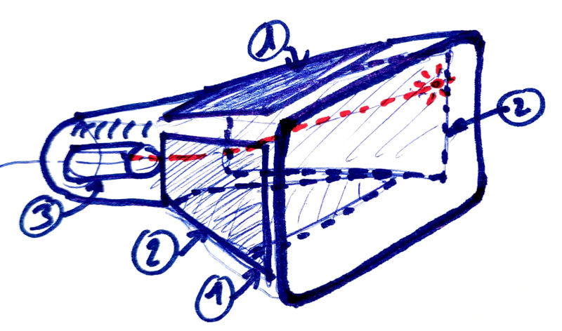
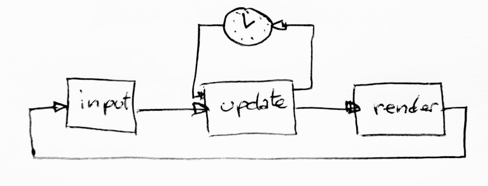

# Adding a Structure

## Core Game methods

So now we had a basic class for our game, we need to add more structure and more feature.

Code is better to understand:

```java
public class Game {
    // Entry point for the game.
    public void run(Strng[] argv) {
        initialize(argv);
        loop();
        dispose();
    }

    // Initialize resources
    private void initialize(String[] argv) {
    }

    // the main Game Loop
    private void loop() {
    }

    // free al resources
    private void dispose() {

    }

    // the java entry point
    private static main(String[] argv) {
        Game g = new Game();
        g.run(argv);
    }
}
```

Our game will start with a main entry point: the `run(argv)` method.

This main method will delegate all the sub processing to other methods:

- `initialize(argv)` will get cli parameters to set new values for title, width and height of the game window. more to
  come in the next chapters.
- `loop()` is the core processing for our game, this where all will happen.
- `dispose()` will be executed to free resources on an exit request, let out from the main `loop()`.

And the method `main(String argv)` to create and run our `Game` object.

We can also present this processing with a Sequence diagram:



_The Game loop sequence diagram._

## The Loop

The `loop` method is where the player(user) input will be processed and where the game and all its internal objects and
entities will be updated accordingly, and finally all those objects will be displayed, if necessary.

```java
public class Game {
    // the flag requesting the game to exit.
    private boolean exit = false;

    //...
    private void loop() {
        long start = System.currentTimeMillis();
        long previous = start;
        long dt;
        while (!exit) {
            start = System.currentTimeMillis();
            dt = start - previous;
            input();
            update(dt);
            draw();
            previous = start;
        }
    }

    // manage user inputs
    private void input() {
    }

    // update Game objects and mechanism
    private void update(long dt) {
    }

    // draw the Game objects to the window
    private void draw() {
    }

//...
}
```

So we will need the corresponding methods in our class:

- `input()` will process user input (the player),
- `update(dt)` will compute position and behavior os objects in the game,
- `draw()` will display all the objects on the game's window.

You've also certainly noticed the boolean `exit`, used to exit the main loop on user or game request. By default, the
boolean is `false`, and to request exiting, just set it `true`.

Another thing you probably noticed is the `dt` computation, passed to the update(dt) method. the dt value is the elapsed
time since previous update call. this will be used to compute some objects moves, taking in the time in math formula.

But before going further, we need a Game Windows !
So let's add a JFrame to create a window and capture keyboard events:

```java
public class Game {
    // the flag requesting the game to exit.
    private boolean exit = false;
    // the game window
    private JFrame frame;

    //...    
    private void initialize(String[] argv) {

        parseArgs(argv);
        // define the JFrame window title
        frame = new JFrame(this.title);

        // please, close the window on exit request
        frame.setDefaultCloseOperation(JFrame.EXIT_ON_CLOSE);

        // define the window Size
        Dimension d = new Dimension(this.width, this.height);
        frame.setPreferredSize(d);
        frame.setMaxSize(d);
        frame.setSize(d);
        frame.pack();
        // let show the window !
        frame.setVisible(true);
    }
    //...    

}
```

### input

We will need to capture the keyboard events to be able at least to interact with the player.

### update

just update the object to be displayed:

### draw

and finally draw things.

## A bit of History

Why the game loop exists ? This is a very good question and the reason why is a historically based answer. Everything
starts from the first ever video game: PONG.


_The original Pong video game from wikipedia_

At this very beginning time, the processor to execute tasks is a very a slow on, almost some hundreds of Khz as CPU
frequency. To understand the scale we are talking about, current processor are running at 2 to 4 GHz !

So processor are very slow, each cycle of CPU is a precious one. So every line of code is very optimized and clearly
dedicated to some precise tasks.

And another element must be taken in account : the display process. At this time, screen where not flat one with a bunch
of LCD, but CRT ones. CRT display screen are based on ionic flow started from a cathode (electronic gun) and moving to
the anode (the screen grid) to excite fluorescent layer in the intern face of the glass bulb.

And swiping the all surface of the screen has a time cost: to display 25 frame per seconds, we need 16ms to swipe a
frame.



_The CRT Tube is nothing more than a big bubble light. (3) the cathode emits ions (1) and (2) are anodes, deflecting ion
ray to screen, lighting a fluorescent dot._

This is the available time for the CPU to prepare next image !

So capturing input, moving things and displaying things must be done in 16ms. And loop again for the next frame.

So the main process is a LOOP. that's why we talk about a Game Loop:


_The method to keep a fixed frame rate_

There is also some advanced version of the Game Loop, where multiple update can be performed between each rendering
phase, the timer is around the update methods only:



_The advanced method to keep a fixed update rate_

I can only invite you to read the fantastic book from Robert Nystrom for details about
the [Game loop](https://gameprogrammingpatterns.com/game-loop.html "Go and read the fantastic Robert Nystrom's Book").
