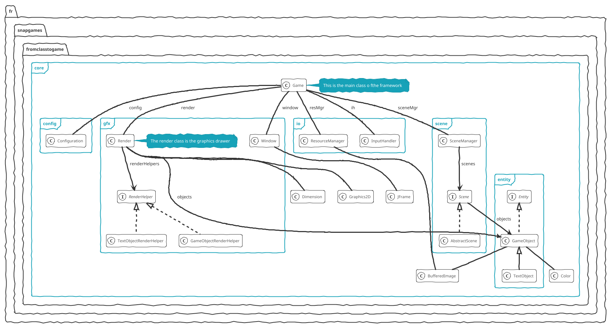
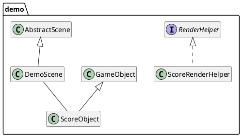

## Architecture

The game has now an internal architecture we need to draw to well understand the links between components.

Here is the core package internal architecture:

_Core package internal architecture_

### An implementation

_A demonstration of a standard implementation_
