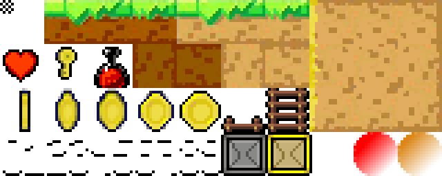

# Tiles and TileMap

In any platform game, we raid through multiple worlds where each levels describe a part of the adventure. Those levels
are sometimes vast, or small, long or short, but each time there are decors and enemies and traps. Each level, if you've
not already noticed it, is composed of multiple little graphic tiles. And those small tiles are also sometimes reused
from level to level: a door, an object, a wall, a dangerous chest ...

So, if you want to code some platform game, you need a technology to display such levels.

Here is where w are going to talk about `Tile`, `TileSet`, `TileLayer` and `TileMap`.

A `TileMap` will be composed of or more `TileLayer`, containing map referencing `Tile`
from one or more `TileSet`.

```text
TileMap
|_ List<GameObject> objects
|_ List<TileSet>
|  |_List<Tile>
|  |_BufferedIMage image
|_ List<TileLayer>
   |_ TileSet
   |_ map array[][]
```

The main `TileLayer` could correspond to the schema :

```text
Play Area
+-(width x height)--------------------------------------------+
|BBBBBBBBBBBBBBBBBBBBBBBBBBBBBBBBBBBBBBBBBBBBBBBBBBBBBBBBBBBBB|
|BBBBX                                                     MBB|
|BBBBXCamera(cx,cy)                                        MBB|
|BBBBX+-(vp.w,vp.h)----------------+                     /-MBB|
|BBBBB|BBBBBBBBBBBBBBBBBBBBBBBBBBBB|BBBBBBBBBBBBX    MBBBBBBBB|
|BBBBB|BBBBBBBBBBBBBBBBBBBBBBBBBBBB|BBBBBBBBBBBBX    MBBBBBBBB|
|BBBX |                            |   BBBBBBBBBX    MBBBBBBBB|
|BBX  |   o     o    o             |       BBBBBX    MBBBBBBBB|
|BBBBB|BBBBBBBBBBBBBBBBBBBBX       |                 MBBBBBBBB|
|BBBBX|           P(x,y)           |    o          /-MBBBBBBBB|
|BBBBX|      MBBBBBBBBBBBBBBBBBBBBB|BBBBBBBBBBBBBBBBBBBBBBBBBB|
|BBBBX|      vBBBBBBBBBBBBBBBBBBBX |     MBBBBBBBBBBBBBBBBBBBB|
|BBBBX+----------------------------+               MBBBBBBBBBB|
|BBBBX                                               L MBBBBBB|
|BBBBX       MBBBBBBBX    o   o   o          MBBBBBBBBBBBBBBBB|
|BBBBX       MBBBBBBBBBBBBBBBBBBBBBBBBBBBBBBBBBBBBBBBBBBBBBBBB|
|BBBBX       MBBBBX                                           |
|BBBBX-\                               C                      |
|BBBBBBBBBBBBBBBBBBBBBBBBBBBBBBBBBBBBBBBBBBBBBBBBBBBBBBBBBBBBB|
+-------------------------------------------------------------+
```

A `TileSet` could be a set of Tile :

| Tile | Name   | Attributes   |
|:----:|:-------|:-------------|
|  P   | player | entity       |
|  E   | enemy  | entity       |
|  E   | enemy  | entity       |
|  B   | wall 1 | block        |
|  X   | wall 2 | block        |
|  M   | wall 3 | block        |
|  -/  | spring | hurt -10   |
|  o   | coin   | money +10   |
|  C   | chest  | money +25   |
|  L   | life   | energy +100  |

## What is a Tile ?

So the basic graphic element we need to use in our worlds levels are tiles.

A Tile is a small graphic element with attributes describing the nature of the tile, its graphics part, and if it is
animated. Yes, if you want to see beautiful coin swinging on itself in the level, w<e need a way to animate it.



_fig. 3 - A Tile set is a simple image with small tile of 16x16 pixels_

A Tile is:

- a code to identify it,
- a size (width x height)
- a graphic part (image) or animation
- some valuable attributes to define it: blocking, killing, moneying, healthing, etc...

for example:,

1. a coin would be:

- code: `'c'`
- size: `16x16`
- a BufferedImage of 16x128 with 8 frames
- attributes: `[type='money',value = 10]`

2. a simple wall would be :

- code: `'w'`
- size: `16x16`
- a BufferedImage of 16x16
- attributes: `[type='block']`

3. an ice floor :

- code: `'i'`
- size: `16x16`
- a BufferedImage of 16x128 with 8 frames (animated reflecting ice)
- frames: `[300,200,200,100,100,200,200,300]`
- attributes [^1]: `[type='block', friction=0.998]`

[1^]: Here are described the frames and their time `frames` in ms.

### the Tile class

here is the following class used in our level data to define a `Tile`:

```java
import java.awt.image.BufferedImage;

public class Tile {
    Char code;
    int width;
    int height;
    Map<String, Object> Attributes;
    BufferedImage image;
    List<Integer> frames;
}
```

In the level properties file, a `Tile` will be described through a `TileSet` (a set of tiles).

## TileSet

A `TileSet` is set of `Tile`... yes, I know. A Set of tile is a list of predefined Tile with all there characteristics,
ready to be use in a `TileLayer` to design a level

A TileSet will contain :

- an internal id (typically an `int`)
- a bitmap image where graphics Tiles will be extracted (most of the time a`BufferedImage`),
- a List of Tile object with all there predefined characteristics (a `Map<String,Object>`).

### the TileSet class

```java
public class TileSet {
    private int id;
    private BufferedImage image;
    private Map<String, Tile> tiles;
}
```

## TileLayer

A map of a level is composed of multiple layers, disposed one behind the other to create depth of view in the level
decor. It would exist 2 type of `TileLayer`:

- a `LayerTileMap` containing a map of tiles
- a `LayerImage` containing a simple image (as background, for example).

1. Here is the `LayerTileMap` with a map.

```java
public class LayerTileMap implements TileLayer {
    private int id;
    private int tileSetId;
    private char[][] map;
    private Map<Char, GameObject> objects;
    private Map<Char, Tile> tiles;
    private int priority;
}
```

This layer object will contain its own :

- internal `id`
- a `tileSetId` referencing a a `TileSet`
- `map` of tiles and objects
- mapping for `GameObject`
- Mapping for `Tile`
- a rendering `priority` to render layer in the correct sort order.

2. the `LayerImage` to produce simple graphics layer

```java
public class LayerUImage implements TileLayer {
    private int id;
    private int priority;
    private BufferedImage image;

}
```

Simpler than the LayerTileMap, it contains :

- mainly only an `image`,
- `id` and `priority` are the same as for the `LayerTileMap`.

## the TileMap

*TODO*

## A level ?

### Presentation

### Level file format

`*.level` file are describing a full level.

```properties
[chapter]
property.simple.name:value
property.name.with.attributes:name=player;image=images/tile01.png;x=132;y=64;w=16;h=16
property.name.with.attributes.map:name=PS_1;definition=[nbparticle=40;duration=1300;acc=(0.23,-0.23)]
property.name.with.vector:attr3=(123,125)
```

*TODO*

> **TIPS**<br/> A level editor will be developed in a next chapter.