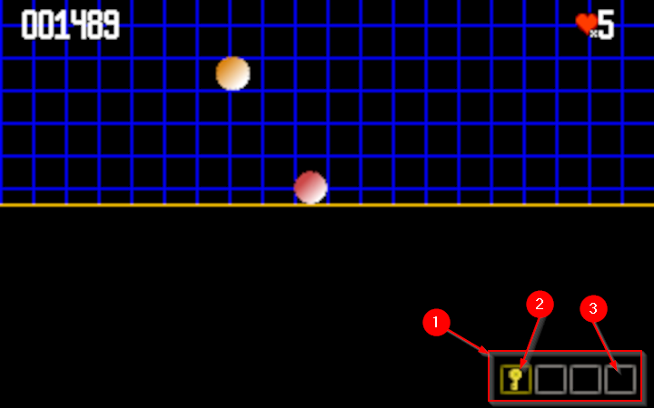

# Inventory

The inventory feature introduce a new dependency inside the GameObject itself.

The InventoryObject, we are going to build, is a GameObject that will display
object the player has collected during the game, and display a max of 4 items in
the bottom right corner of the display.

The 4 items are displayed into a group of placeholder materialized by some graphic squares.
Gray ones are the available ones, and gold one is the active one.



1. The `InventoryObject` area display a specific number of available placeholder's item
2. The current active item is highlighted with a gold squared selector,
3. other placeholder are free space for future collectible items.

## The Inventory object

`InventoryObject` class is a list of empty slots, where some object can be stored. The dynamic maximum number of objects to be stack can evolve during the play.

```java
public class InventoryObject extends GameObject {

    private int nbPlaces = 1;
    private int selectedIndex = 1;

    List<GameObject> items = new ArrayList<>();

    public InventoryObject(String name, double x, double y) {
        super(name, new Vector2d(x, y));

    }

    public InventoryObject add(GameObject gio) {
        if (gio.getAttribute("inventory") != null) {
            items.add(gio);
        }
        return this;
    }

    public void remove(GameObject gio) {
        if (items.contains(gio)) {
            items.remove(gio);
        }
    }
}

```

In this inventory, you will be able to `add()` or `remove()` some `GameObject` dynamically, through keyboard interaction, to be managed with a specific `Behavior` implementation.

Inheriting from the `GameObject` itself, the `InventoryObject` will be managed like others in the rendering and update stack.

By default, the object stay stick to the screen with a `.relativeToCamera(true)`:

In the `DemoScene` class, the `InventoryObject` is added in the create() method:

```java
InventoryObject inventory =
    (InventoryObject) new InventoryObject(
        "inventory",
        vp.getWidth() - 2,
        vp.getHeight() - 4)
        .setNbPlace(4)
        .setSelectedIndex(1)
        .relativeToCamera(true)
        .add(new InventorySelectorBehavior());

add(inventory);
```

You can notice the `InventorySelectorBehavior` added to the `InventoryObject` to manage user interactions.

It would be a good practice to add this behavior in the `InventoryObject` constructor, but the `Behavior` would be invisible from the developer point of view.

## How to display the Inventory ?

The drawing operations are performed through a Dedicted RenderHelper implementation.

The inventory must be displayed with empty placeholders at the bottom right of the screen, where collected objects will be dock (see (1) on illustration).

All the placeholder cases will be first displayed, and then, if that case contains any object, the corresponding object will be displayed with a dedicated Image stored in a "inventory" `GameObject` attribute.

> **Note**
> So if you want to transform any `GameObject` into one that can ve stored in this inventory, just add a `BufferedImage` as "inventory" attribute to the `GameObject`.

Let's focus on the `draw` method for this `InventoryRenderHelper`:

```java
@Override
public void draw(Graphics2D g, Object o) {
    InventoryObject go = (InventoryObject) o;

    // retrieve all object from the inventory
    List<GameObject> itemImages = go.getItems()
        .stream().filter((v)
        -> v.getAttribute("inventory") != null)
        .collect(Collectors.toList());

    // parse all available places and display corresponding object.
    for (int i = 0; i < go.getNbPlaces(); i++) {
        int rx = (int) go.position.x
            - (selector.getWidth() + spacing) * go.getNbPlaces();
        int ry = (int) go.position.y
            - (selector.getHeight() + spacing);
        BufferedImage sel = go.getSelectedIndex() == i + 1
            ? selected
            : selector;
        g.drawImage(sel,
                (int) rx + (i * (selector.getWidth()) + spacing),
                (int) ry,
                null);
        if (!itemImages.isEmpty() && itemImages.size() > i) {
            BufferedImage itemImg =
                (BufferedImage) itemImages.get(i)
                    .getAttribute("inventory");
            int dx = (selector.getWidth() - itemImg.getWidth()) / 2;
            int dy = (selector.getHeight() - itemImg.getHeight()) / 2;
            g.drawImage(itemImg,
                (int) rx + (i * (selector.getWidth()) + spacing + 1 + dx),
                (int) ry + 1 + dy, null);
        }
    }
}
```

## Selecting an item

As defined inthe `InventoryObject` chapter, the user(player) can manage its inventiry by pressing one of the keys between 1 to 4 (the maximmum would be 9) key touch in our `DemoScene` (see `setNbplace(4)`).

The interacting behavior will be managed with the `InventorySelectorBehavior`.

All the magic takes place into the `input` behavior method:

```java
class InputSelectorBehavior implements Behavior {
    //...
    public void input(GameObject go, InputHandler ih) {
        InventoryObject io = (InventoryObject) go;
        testKey(ih, io, KeyEvent.VK_1, 0, 1);
        testKey(ih, io, KeyEvent.VK_2, 1, 2);
        testKey(ih, io, KeyEvent.VK_3, 2, 3);
        testKey(ih, io, KeyEvent.VK_4, 3, 4);
        testKey(ih, io, KeyEvent.VK_5, 4, 5);
        testKey(ih, io, KeyEvent.VK_6, 5, 6);
        testKey(ih, io, KeyEvent.VK_7, 6, 7);
        testKey(ih, io, KeyEvent.VK_8, 7, 8);
        testKey(ih, io, KeyEvent.VK_9, 9, 9);
        testKey(ih, io, KeyEvent.VK_0, 10, 10);
    }

    private void testKey(InputHandler ih, InventoryObject io, int vk1, int i, int i2) {
        if (ih.getKey(vk1) && io.getNbPlaces() > i) {
            io.setSelectedIndex(i2);
        }
    }
    //...
}
```
