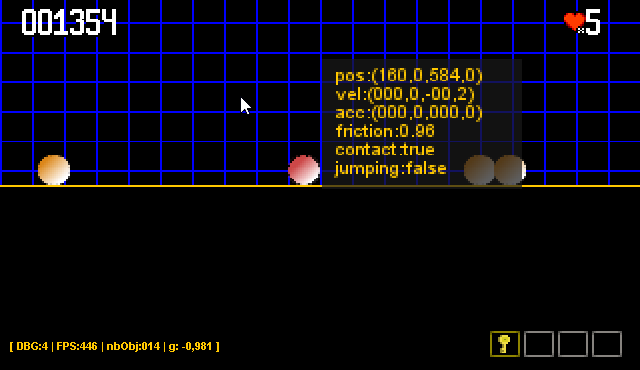

# Enhancing Behavior

The existing Behavior we've just created is dedicated to the GameObject. But, regarding the Scene implementation, we
have some common needs between both, like managing, but at Scene level, some player or user input, like debug
configuration or else, and the Behavior interface would be very interesting to be used here.

Thanks to this interface we would be able to implement input, update or renderer specific requirement.

So let's adapt the Behavior interface to this new need.

## The parameterized Behavior

So now the Behavior is dedicated to the GameObject, so the received object to apply the required processing is a
GameObject.

Changing this will simply consist in replacing GameObject in the interface by a T parameter:

```java
public interface Behavior<T> {
    void onInput(T go, ActionHandler ih);

    void onUpdate(T go, long dt);

    void onRender(T go, Render r);

    void onAction(T go, ActionHandler.ACTIONS action);
}
```

So creating a SceneBehavior will be :

```java
public class MySceneBehavior implements Behavior<Scene> {
    void onInput(T go, ActionHandler ih) {
        if (ih.get(KeyEvent.VK_D)) {
            // do fancy thing to manage Debug display.
        }
    }

    void onUpdate(T go, long dt) {
    }

    void onRender(T go, Render r) {
    }

    void onAction(T go, ActionHandler.ACTIONS action) {
    }
}
```

> **TIPS**<wbr/> The Scene behavior are tested with the [Scene_can_have_behaviors.feature](../../src/test/resources/features/Scene_can_have_behaviors.feature) feature file.

## The Debug switcher

Here is the opportunity to capture the <kbd>D</kbd> key and activate> some incredible stuff.

But to activate this scene behavior, the SceneManager must be adapted and the Game class modified.

Moving the debug switching capability to a dedicated scene Behavior would be a very good first implementation sqample:

First create a new Behavior<Scene> :

```java
public class DebugSwitcherBehavior implements Behavior<Scene> {
    private static int cpt = 0;
}
```

the cpt attribute exists to manage key repetition factor. As there is not already existing  `onKeyPressed` or
`onKeyReleased` event, we must manage the key repetition with an internal counter. (maybe a future evolution for
our `Behavior` interface)

We are going to detect the action event:

```java
public class DebugSwitcherBehavior implements Behavior<Scene> {
    //...
    @Override
    public void onInput(Scene go, ActionHandler ah) {
        if (ah.get(KeyEvent.VK_D)) {
            cpt++;
            if (cpt > 20) {
                cpt = 0;
                switchDebugLevel(go);
            }
        }
    }
    //...
}
```

Each 20 <kbd>D</kbd> key press detection (as debug) , we will increment the debug level, looping on 5 levels.

The 20 value is not a random number, but 20*16ms (at 60 FPS) correspond to wait for approximately 300 ms, the delay
between 2 key press of the <kbd>D</kbd> key.

```java
public class DebugSwitcherBehavior implements Behavior<Scene> {
    //...
    private void switchDebugLevel(Scene go) {
        int d = go.getGame().getWindow().getDebug();
        d = d < 5 ? d + 1 : 0;
        go.getGame().getWindow().setDebug(d);
    }
}
```

You will have to add this new `Behavior<Scene>` to the `DemoScene` :

In the  `Scene#create()` :

```java
class DemoScene extends AbstractScene {
    //...
    @Override
    public void create(Game g) throws UnknownResource {
        //...
        addBehavior(new DebugSwitcherBehavior());
    }
    //...
}
```

And now running the `Game`, and pressing the D more than 300ms, you will obtain :



A bunch of debug information is displayed about any `GameObject` having their debug flag set to value greater than 0.
