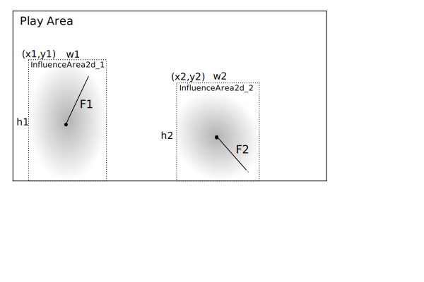

# Area of Influence

The `PhysicEngine` is already a good thing to process basic forces and compute position for objects. But something is
missing, how can we enhance it by adding some world events like wind, magnetic forces, and so on ?

We will first add some area of influence where when objects are colliding with, the new elementary declared force is
applied to.

## World 2.0

The World must handle those areas, so let's add them.

```java
public class World {
    //...
    /**
     * Possible influence areas in this world (wind, magnetic, water flow, other ?)
     */
    public List<Influencer> influenceAreas = new ArrayList<>();
    //...

    /**
     * Add an Influence area to the world.
     *
     * @param area the InfluenceArea to add to the World.
     * @return this updated World
     */
    public World addInfluenceArea(Influencer area) {
        influenceAreas.add(area);
        return this;
    }
}
```

So first add a list of area, and add a method to let adding some new influencers ;)

But we need to define those `Influencer`:

```java
public class Influencer {

    /**
     * Influence Force for this influence Area
     */
    public Vector2d force = new Vector2d();
    public BoundingBox influenceArea;
    public double energy = 1.0;

    public Vector2d position = new Vector2d();
    private BoundingBox.BoundingBoxType type = BoundingBox.BoundingBoxType.RECTANGLE;
}
```

To understand what is an InfluenceArea, a little diagram will help a lot.



So in the play area, we've defined here 2 areas:

- InfluenceArea_1 at position (x1,y1) with a size of w1 x h1, having a force of F1
- InfluenceArea_1 at position (x2,y2) with a size of w2 x h2, having a force of F2

## The PhysicEngine update

```java

public class PhysicEngine extends AbstractSystem {
    public void update(GameObject go, long dt) {
        //...

        // Apply World influence
        applyWorldInfluenceList(go);
        //...
    }
    //...
    
    
    private Vector2d applyWorldInfluenceList(GameObject go) {
        Vector2d acc = new Vector2d();
        if (!world.influencers.isEmpty() && !go.relativeToCamera) {
            for (Influencer i : world.influencers) {
                if (i.area.intersect(go.bbox)) {
                    double influence = i.getInfluenceAtPosition(go.position);
                    Vector2d accIA = i.force.multiply(influence).multiply(i.energy);
                    acc = acc.add(accIA);
                }
            }
        }
        return acc;
    }
    //...
}

```

## Enhancing GameObject and Influencer

To simplify both `GameObject` and `Influencer`, we may create a common parent object from which both will inherit. Let's
create an AbstractEntity containing all the common attributes and mechanics `GameObject` and `Influencer` are sharing

### The AbstractEntity

Both objects are defining id, index, and name parameters, but also sharing the needs for a position, a with and a
height, and a BoundingBox.

Let's create a parent class proposing such attributes with their accessors:

```java
public class AbstractEntity<T> implements Entity<T> {
    private static int index = 0;
    public int id;
    public String name;
    public Vector2d position;
    public boolean active = true;
    public double width;
    public double height;
    public BoundingBox bbox = new BoundingBox();

    //...
}
```

We need to dsefine some class construtors to initialize attributes, like GameObject and Influencer use to do:

```java

public class AbstractEntity<T> implements Entity<T> {
    //...

    public AbstractEntity() {
        id = index++;
        name = "entity_" + id;
    }

    public AbstractEntity(String name) {
        this();
        this.name = name;
    }

    public AbstractEntity(String name, Vector2d position) {
        this(name);
        this.position = position;
    }
}
```

And you may certainly noticed we need to display debug infirmatoin. a lot of debug meta data are shatred between thos 2
objects to draw debug info:

```java
public class AbstractEntity<T> implements Entity<T> {
    //...
    public int debugLevel = 0;
    public Color debugFillColor = new Color(0.8f, 0.4f, 0.2f, 0.25f);
    public Color debugLineColor = Color.RED;
    public int debugOffsetX = -40;
    public int debugOffsetY = 10;
    protected Color debugColor;
    //...
}
```

> **NOTE**<br/>
> All those attributes are only for debug display purpose: `debugLevel` to define at which debug global value this object
> debug info will be displayed in `debug` mode, `debugFillColor` and `debugLineColor` are meta to draw info, like
> `debugOffsetX` and `debugOffsetY` used to define metadata display position relative to concerned object


Then previous created objects are clearly simplified; see
[`GameObject.java`](../../src/main/java/fr/snapgames/fromclasstogame/core/entity/GameObject.java "see source code")
and
the [`Influencer.java`](../../src/main/java/fr/snapgames/fromclasstogame/core/physic/Influencer.java "see source code").


## Adding some debug visual information

Another RenderHelper must be added to the stack to renderer the `InfluenceAre` to get visual debugging information, to
help developers understand possible issue. This is the `DebugInfluenceAreaRenderHelper`.

**TODO** _Modify Influencer to inherit from `GameObject` and modify World to use its new attributes_
