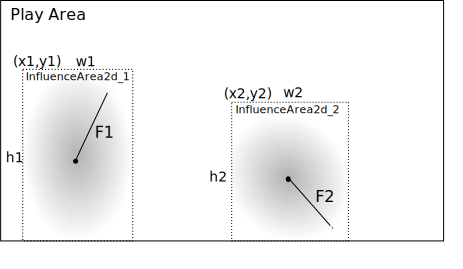

# Area of Influence

The `PhysicEngine` is already a good thing to process basic forces and compute position for objects. But something is
missing, how can we enhance it by adding some world events like wind, magnetic forces, and so on ?

We will first add some area of influence where when objects are colliding with, the new elementary declared force is
applied to.

## World 2.0

The World must handle those areas, so let's add them.

```java
public class World {
    //...
    /**
     * Possible influence areas in this world (wind, magnetic, water flow, other ?)
     */
    public List<InfluenceArea2d> influenceAreas = new ArrayList<>();
    //...

    /**
     * Add an Influence area to the world.
     *
     * @param area the InfluenceArea to add to the World.
     * @return this updated World
     */
    public World addInfluenceArea(InfluenceArea2d area) {
        influenceAreas.add(area);
        return this;
    }
}
```

So first add a list of area, and add a method to let adding some new influencers ;)

But we need to define those `InfluenceArea2d`:

```java
public class InfluenceArea2d {

    /**
     * Influence Force for this influence Area
     */
    public Vector2d force = new Vector2d();
    public BoundingBox influenceArea;
    public double energy = 1.0;

    public Vector2d position = new Vector2d();
    private BoundingBox.BoundingBoxType type = BoundingBox.BoundingBoxType.RECTANGLE;
}
```

To understand what is an InfluenceArea, a little diagram will help a lot.



So in the play area, we've defined here 2 areas:

- InfluenceArea_1 at position (x1,y1) with a size of w1 x h1, having a force of F1
- InfluenceArea_1 at position (x2,y2) with a size of w2 x h2, having a force of F2

## The PhysicEngine update

```java

public class PhysicEngine extends AbstractSystem {
    public void update(GameObject go, long dt) {
        //...

        // Apply World influence
        applyInfluences(go);
        //...
    }
    //...

    /**
     * Apply World influence Area to the {@link GameObject} <code>go</code>.
     *
     * @param go the {@link GameObject} to
     */
    private void applyInfluences(GameObject go) {
        if (world.influenceAreas.size() > 0) {
            for (InfluenceArea2d area : world.influenceAreas) {
                if (area.influenceArea.intersect(go.bbox)) {
                    double influence = area.getInfluenceAtPosition(go.position);
                    go.acceleration.add(area.force.multiply(influence));
                }
            }
        }
    }
    //...
}

```

## Adding some debug visual information

Another RenderHelper must be added to the stack to render the `InfluenceAre` to get visual debugging information, to help developers understand possible issue. This is the `DebugInfluenceAreaRenderHelper`.

**TODO** _Modify InfluenceArea2d to inherit from `GameObject` and modify World to use its new attributes_
