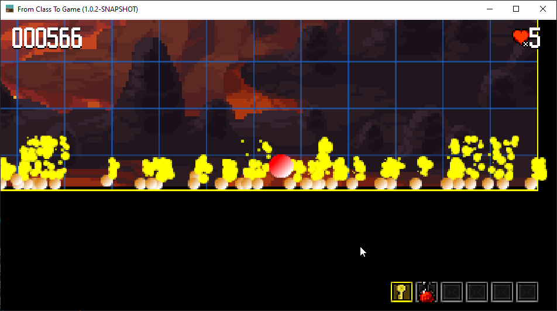

## A simple approach

Starting with a very simple class, we will create a brand new Game, by adding some features, step by step.

## chapters

- **[01](https://github.com/mcgivrer/fromClassToGame/tree/8e203b98a5db51c9b9586a6eaed6e5a0ee8ee0e2 "see github commit log")**.  [A class ?](chapters/01-a-class.md)
- **[02](https://github.com/mcgivrer/fromClassToGame/tree/7c621c4aaa11f327e8f7b83eedfbcff306bc606a "see github commit log")**. [Adding a structure](chapters/02-adding-a-structure-the-game-loop.md)
- **[03](https://github.com/mcgivrer/fromClassToGame/tree/6a337b8955f1a53730d2b2167b865c42ca955203 "see github commit log")**. [Delegate things](chapters/03-delegate-things.md)
- **[04](https://github.com/mcgivrer/fromClassToGame/tree/cece0b3c0dd1598289ef51e7eac309919c99e032 "see github commit log")**. [the Object Game](chapters/04-the-object-game.md)
- **[05](https://github.com/mcgivrer/fromClassToGame/tree/0ddb5d58073149f5454c3f682e94e38a5a4972a7 "see github commit log")**. [Input Handler](chapters/05-input-handler.md)
- **[06](https://github.com/mcgivrer/fromClassToGame/tree/521e07b81f059e17df41fe0b4ecfbdf93632eaef "see github commit log")**. [New components](chapters/06-new-components.md)
- **[07](https://github.com/mcgivrer/fromClassToGame/tree/c93d4f167e6499721ddf5403e33c5dd1b589e25c "see github commit log")**. [Resource manager](chapters/07-resource-manager.md)
- **[08](https://github.com/mcgivrer/fromClassToGame/tree/3f81e8d66d7cc597eefee80117a0194449168c66 "see github commit log")**. [Scene Manager](chapters/08-scene-manager.md)
- **[09](https://github.com/mcgivrer/fromClassToGame/tree/f9cd5ff878d635c01e8f5d65a74b9ef30624aeda "see github commit log")**. [extract configuration](chapters/09-extract-configuration.md)
- **[10](https://github.com/mcgivrer/fromClassToGame/tree/ "see github commit log")**. [refactoring packages](chapters/10-refactoring-packages.md)
- **[11](https://github.com/mcgivrer/fromClassToGame/tree/ "see github commit log")**. [Score and Render Helpers](chapters/11-score-and-renderer-helper.md)
- **[12](https://github.com/mcgivrer/fromClassToGame/tree/ "see github commit log")**. [See through a Camera](chapters/12-see-through-camera.md)
- **[13](https://github.com/mcgivrer/fromClassToGame/tree/ "see github commit log")**. [Basic of a Physic Engine](chapters/13-basic-physic-engine.md)
- **[14](https://github.com/mcgivrer/fromClassToGame/tree/ "see github commit log")**. [Collision System](chapters/14-collision-system.md)
- **[15](https://github.com/mcgivrer/fromClassToGame/tree/ "see github commit log")**. &lt;WIP&gt;[Tiles and TileMap](chapters/15-tile-and-tilemap.md)
- **[16](https://github.com/mcgivrer/fromClassToGame/tree/ "see github commit log")**. [GameObject and Behaviors](chapters/16-gameobject-and-behaviors.md)
- **[17](https://github.com/mcgivrer/fromClassToGame/tree/ "see github commit log")**. [Managing a quick Inventory](chapters/17-inventory.md)
- **[18](https://github.com/mcgivrer/fromClassToGame/tree/ "see github commit log")**. [Enhancing the Behavior](chapters/18-enhanced-behavior.md)
- **[19](https://github.com/mcgivrer/fromClassToGame/tree/ "see github commit log")**. [Particles are beautiful](chapters/19-particles-are-beautiful.md)
- **[20](https://github.com/mcgivrer/fromClassToGame/tree/ "see github commit log")**. [Area of influence](chapters/20-area-of-influence.md)
- **[21](https://github.com/mcgivrer/fromClassToGame/tree/ "see github commit log")**. [Enhancing the Rendering pipeline](chapters/21-enhancing-rendering-pipeline.md)
- **[22](https://github.com/mcgivrer/fromClassToGame/tree/ "see github commit log")**. [Add Child relation link](chapters/22-add-child-relation-link.md)
- **[23](https://github.com/mcgivrer/fromClassToGame/tree/ "see github commit log")**. [Adding lights](chapters/23-adding-lights.md)

----

- **[24](https://github.com/mcgivrer/fromClassToGame/tree/ "see github commit log")**. Menu and Scene navigation _(coming soon)_

----

- **[100](https://github.com/mcgivrer/fromClassToGame/tree/ "see github commit log")**. [Global Architecture](chapters/100-architecture.md)

More to come... stay Tuned !

Mc G.
