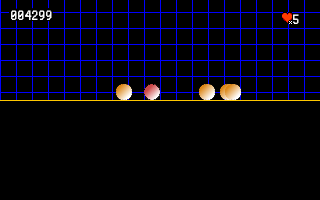

## A simple approach

Starting with a very simple class, we will create a brand new Game, by adding some features, step by step.

## chapters

1. [A class ?](chapters/01-a-class.md)
2. [Adding a structure](chapters/02-adding-a-structure.md)
3. [Delegate things](chapters/03-delegate-things.md)
4. [the Object Game](chapters/04-the-object-game.md)
5. [Input Handler](chapters/05-input-handler.md)
6. [New components](chapters/06-new-components.md)
7. [Resource manager](chapters/07-resource-manager.md)
8. [Scene Manager](chapters/08-scene-manager.md)
9. [extract configuration](chapters/09-extract-configuration.md)
10. [refactoring packages](chapters/10-refactoring-packages.md)
11. [Score and Render Helpers](chapters/11-score-and-render-helper.md)
12. [See through a Camera](chapters/12-see-through-camera.md)
13. [Basic of a Physic Engine](chapters/13-basic-physic-engine.md)
14. [Collision System](chapters/14-collision-system.md)
15. [GameObject and Behaviors](chapters/16-gameobject-and-behaviors.md)
16. [Managing a quick Inventory](chapters/17-inventory.md)
17. [Global Architecture](chapters/100-architecture.md)

More to come... stay Tuned !

Mc G.
