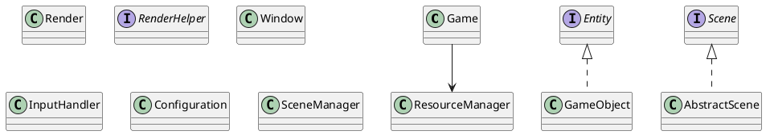

## Architecture

THe game has now an internal architecture we need to draw to well understand the links between components.

```plantuml
@startuml
class Game
interface Entity
class GameObject implements Entity
class ResourceManager
class Render
interface RenderHelper
class Window
class InputHandler
class Configuration
interface Scene
class AbstractScene implements Scene
class SceneManager

Game --> ResourceManager

@enduml
```