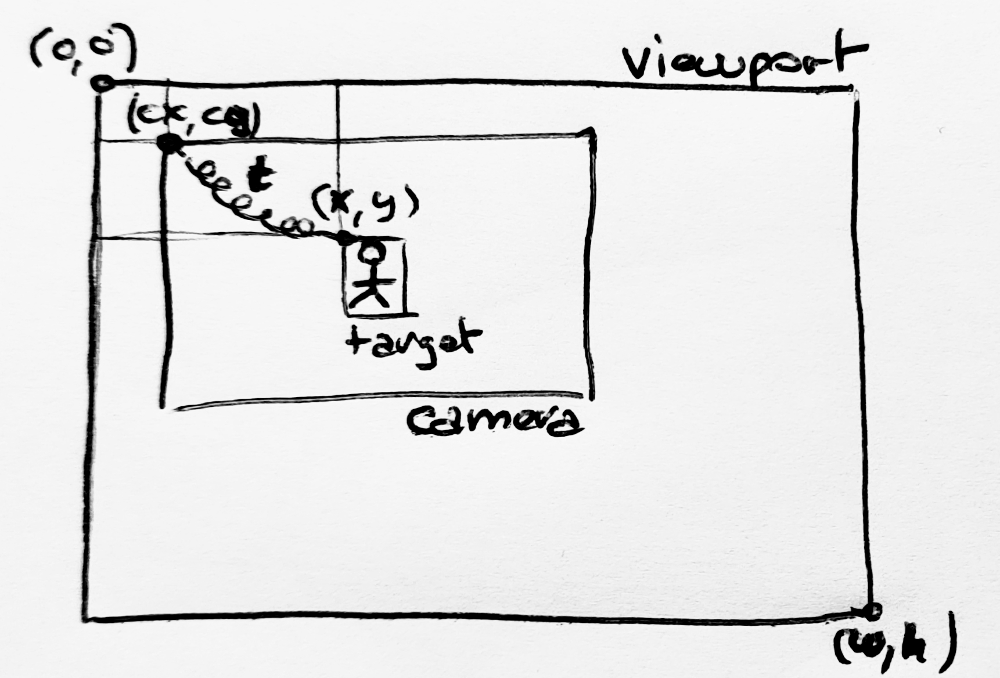

# See through a Camera

In every game, there is a critic chapter about how the "camera" is managed. But what does this means exactly ?

The Camera is a virtual point of view, following the main character across a game level. The way the camera will follow
the player is very important because the user experience about how the player feel the game is very important. And the
first feeling of the player about a game is the behavior of this camera.

But how a camera is following a target ? Let's have a diagram to explain that.



_A Camera follows a target in a viewport_

The target, the **player**, at `(x,y)`, is targeted by the **camera** at `(cx,cy)` moving into the **viewport** having
with x height of `(w,h)`. The `t` **factor**, visualized by s spring on the diagram symbolized the behavior of how the
camera will follow the camera, the t is a small delay applied to the camera moves, based on the target moves.

The simple math formula below explains how the t factor is used to compute the camera position:

```math
Camera(position) += Target(position) + Target(size) - Camera(size)/2) x t x dt
```

And has we are in a time measured update process, see the `GameObject#update(dt)`, we need to multiply the resulting
value by the elapsed time since previous call `dt` (as Delta Time)

the corresponding code would be :

```java
class Camera extends GameObject {
    private Dimension viewport;
    private GameObject target;
    private double t;

    void update(long dt) {
        x += target.x + target.w - (viewport.width * 0.5f - x) * t * dt;
        y += target.y + target.h - (viewport.height * 0.5f - y) * t * dt;
    }
}
```

Now we can add the `Camera` to the framework and reserve a dedicated processing to this kind of object in term or
rendering. yes, in this specific case, the `Camera` is not drawn as other object, it is simply moving the point of view
according to its own position.

## Modifying the Render class

> _**TODO** modify the Render class_
>
> - _Add a Camera point of view in the Render process_
> - _Add a method to add a Camera_
> - _Sort and filter objects to split Camera and others_

## Modify Scene and AbstractScene classes

> **TODO** modify the Scene and the AbstractScene
>
> - _Add a method to add a camera to the Scene_
> - _Add a list of Camera to the Scene_
> - _Automatically add the Camera from the scene to the Render pipeline._

## Adapt DemoScene class

> **TODO** modify the DemoScene
>
> - _Add a Camera to the DemoScene_
