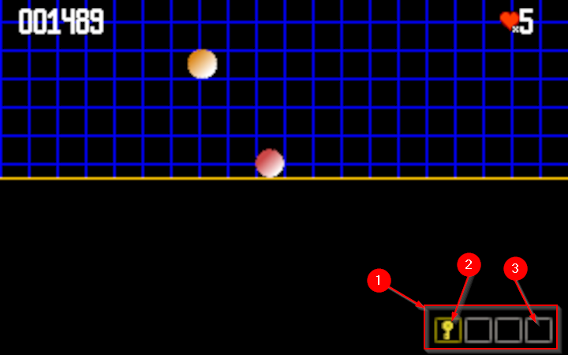

## Inventory

The inventory feature introduce a new dependency inside the GameObject itself.

The InventoryObject, we are going to build, is a GameObject that will display
object the player has collected during the game, and display a max of 4 items in
the bottom right corner of the display.

The 4 items are displayed into a group of placeholder materialized by some graphic squares.
Gray ones are the available ones, and gold one is the active one.

1. The `InventoryObject` area display a specific number of available placeholder's item
2. The current active item is highlighted with a gold squared selector,
3. other placeholder are free space for future collectible items. 

### The InventoryObject

The inventory object is the main object to manage, contain and display the Items in the current inventory.
It will contain sub objects, the items, and let the player select one through a maximum number of objects.

> _**NOTE**_ 
> _The capability to reference other GameObjects could be delegated to the GameObject itself in a second step._

the class for the InventoryObject is quietly simple by proposing first an extension of the already existing 
GameObject, and then adding some internalk attributes:

- nbPlaces : a number of possible available place in the displayed inventory
- items : the list of GameObject in the inventory,
- selectedIndex : the current active item.

### The InventoryRenderHelper

_TODO_
 
### the InventorySelectorBehavior

_TODO_
