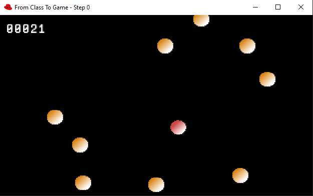

## A simple approach

Starting with a very simple class, we will create a brand new Game, by adding some features, step by step.

## chapters

- [A class ?](chapters/01-a-class.md)
- [Adding a structure](chapters/02-addind-a-structure.md)
- [Delegate things](chapters/03-delegate-things.md)
- [the Object Game](chapters/04-the-object-game.md)
- [Input Handler](chapters/05-input-handler.md)
- [New components](chapters/06-new-components.md)
- [Resource manager](chapters/07-resource-manager.md)
- [Scene Manager](chapters/08-scene-manager.md)
- [extract configuration](chapters/extract-configuration.md)
- [refactoring packages](chapters/refactoring-packages.md)

More to come... stay Tuned !

Mc G.
