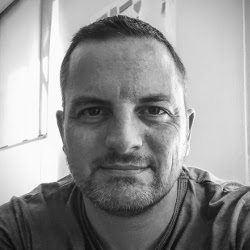

# _About_

The author of this smart book is in the IT industry for many years, started the adventures on cumputer in the early 80's, when all the computers were not only Apple or PC's ;)

Evolving from developer to architect, first on multiple languages like Pascal, C, C++ and VB (erk...) then specialized on the Java languages and a t the same time jump'into the Web2.0 move, Frédéric Delorme is a mind free Lead Software Architect, part time craftmanship and idealist at its spare time, but a pragmatic professional when it goes to serious things.
